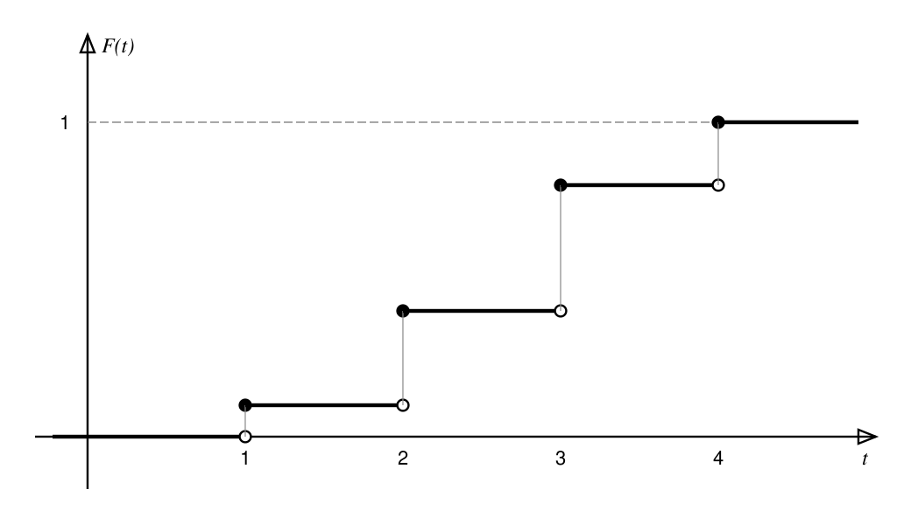

# Случайные величины {#sec:rv}

Пусть задано вероятностное пространство $(\Omega, \mathcal A, \mathsf P)$, где $\Omega$ —
множество элементарных исходов, $\mathcal A$ — $\sigma$-алгебра событий, а $\mathsf P$ —
вероятностная мера [[H1:p1]]. Часто нас интересует не сам исход $\omega$, а некоторое
числовое значение, которое он определяет: сумма очков на костях, время ожидания, доход.

<!-- H1.b001 definition -->
::: {.definition #def:rv title="Случайная величина"}
Отображение $X:\Omega\to\mathbb R$ называется *случайной величиной* (random variable), если
$\{\omega : X(\omega)\le t\}\in\mathcal A$ для всех $t\in\mathbb R$.[[H1:p1]][[S1:s12]]
:::

Условие измеримости гарантирует, что вероятность $\mathsf P(X\le t)$ определена для любого
$t$. Эквивалентно можно требовать $X^{-1}(B)\in\mathcal A$ для всех борелевских множеств
$B\in\mathcal B(\mathbb R)$[^borel] [[V1:12:34]].

[^borel]: Борелевская $\sigma$-алгебра $\mathcal B(\mathbb R)$ — наименьшая
$\sigma$-алгебра, содержащая все интервалы числовой прямой.

<!-- src: H1.b002 -->
::: {.remark}
Слово «величина» историческое: $X$ — это функция, а «случайна» не она сама, а её аргумент
$\omega$. <!-- inline note for the editor -->Значение $X(\omega)$ становится известным
только после эксперимента.
:::

## Функция распределения {#sec:cdf}

::: {.definition #def:cdf title="Функция распределения"}
*Функцией распределения* случайной величины $X$ называется функция
$$
F_X(t) = \mathsf P(X \le t), \qquad t \in \mathbb R .
$$
:::

::: {.theorem #thm:cdf-props title="Свойства функции распределения"}
Функция распределения $F_X$ любой случайной величины обладает свойствами:

1. $F_X$ не убывает;
2. $F_X$ непрерывна справа в каждой точке;
3. $\lim\limits_{t\to-\infty}F_X(t)=0$ и $\lim\limits_{t\to+\infty}F_X(t)=1$.
:::

::: {.proof}
Если $s<t$, то $\{X\le s\}\subseteq\{X\le t\}$, поэтому по монотонности меры
$F_X(s)\le F_X(t)$. Для непрерывности справа возьмём $t_n\downarrow t$; события
$A_n=\{X\le t_n\}$ убывают и $\bigcap_n A_n=\{X\le t\}$, откуда по непрерывности
вероятностной меры
\begin{align*}
F_X(t_n) &= \mathsf P(A_n) \\
         &\longrightarrow \mathsf P\Bigl(\bigcap_{n=1}^{\infty} A_n\Bigr) = F_X(t).
\end{align*}
Пределы на бесконечности получаются так же из $\bigcup_n\{X\le n\}=\Omega$ и
$\bigcap_n\{X\le -n\}=\varnothing$ [[S1:s13]] [[V1:15:02]].
:::

На [рисунке](#fig:cdf) показана типичная функция распределения дискретной величины: она
кусочно-постоянна и имеет скачки в точках, которые величина принимает с положительной
вероятностью.

{#fig:cdf width=72%}

## Дискретные и непрерывные величины {#sec:types}

Величина $X$ *дискретна*, если она принимает не более чем счётное число значений
$x_1, x_2, \dots$, и *абсолютно непрерывна*, если существует плотность $f_X\ge 0$, такая что
$F_X(t)=\int_{-\infty}^{t} f_X(u)\,du$ [[S1:s15]].

: Основные распределения {#tbl:dists}

| Распределение        | Обозначение               | $\mathsf P(X=k)$ или $f_X(x)$                         | $\mathsf E X$   |
|:---------------------|:--------------------------|:------------------------------------------------------|:---------------:|
| Бернулли             | $\mathrm{Bern}(p)$        | $p^k(1-p)^{1-k}$, $k\in\{0,1\}$                       | $p$             |
| Биномиальное         | $\mathrm{Bin}(n,p)$       | $\binom{n}{k}p^k(1-p)^{n-k}$                          | $np$            |
| Пуассона             | $\mathrm{Pois}(\lambda)$  | $\dfrac{\lambda^k}{k!}e^{-\lambda}$                   | $\lambda$       |
| Равномерное          | $U[a,b]$                  | $\dfrac{1}{b-a}$ при $x\in[a,b]$                      | $\dfrac{a+b}{2}$ |
| Нормальное           | $\mathcal N(\mu,\sigma^2)$ | $\dfrac{1}{\sigma\sqrt{2\pi}}e^{-(x-\mu)^2/2\sigma^2}$ | $\mu$          |

::: {.example #ex:bernoulli title="Схема Бернулли"}
Проводится $n$ независимых испытаний, в каждом из которых успех наступает с вероятностью
$p$. Число успехов $S_n$ имеет биномиальное распределение: $\mathsf P(S_n=k)=\binom{n}{k}p^k
q^{n-k}$, где $q=1-p$ [[H1:p2]].
:::

::: {.lemma #lem:jumps}
У функции распределения не более чем счётное множество точек разрыва.
:::

::: {.corollary}
Дискретная величина однозначно задаётся набором пар $(x_i, p_i)$, где
$p_i = F_X(x_i) - F_X(x_i-0) > 0$.
:::

::: {.problem #prob:dice title="Сумма очков"}
Бросают две симметричные игральные кости. Найдите $\mathsf P(X\le 4)$, где $X$ — сумма
выпавших очков.
:::

::: {.solution}
Всего $36$ равновозможных исходов. Благоприятные исходы для $X\le4$:
$$
\begin{aligned}
X=2 &: (1,1), \\
X=3 &: (1,2),\ (2,1), \\
X=4 &: (1,3),\ (2,2),\ (3,1).
\end{aligned}
$$
Итого $6$ исходов, поэтому $F_X(4)=\mathsf P(X\le 4)=\dfrac{6}{36}=\dfrac16$.
:::

# Числовые характеристики {#sec:moments}

*Математическое ожидание* дискретной величины —
$\mathsf E X=\sum_i x_i p_i$, абсолютно непрерывной — $\mathsf E X=\int_{\mathbb R} x f_X(x)\,dx$
(если ряд или интеграл сходится абсолютно). *Дисперсия* $\mathsf D X=\mathsf E(X-\mathsf E X)^2
=\mathsf E X^2-(\mathsf E X)^2$ (см. [теорему о свойствах](#thm:cdf-props) и
[определение](#def:cdf)).

::: {.theorem #thm:linearity}
Для любых случайных величин $X$, $Y$ с конечными математическими ожиданиями и чисел
$a, b\in\mathbb R$ выполнено $\mathsf E(aX+bY)=a\,\mathsf E X+b\,\mathsf E Y$.
:::

Эмпирическую оценку среднего удобно проверить моделированием:

```python
import numpy as np

rng = np.random.default_rng(seed=3)
# Оценка математического ожидания суммы очков на двух костях
rolls = rng.integers(1, 7, size=(100_000, 2)).sum(axis=1)
print(f"Среднее: {rolls.mean():.3f}, теоретически 7")
```

# Расхождения между источниками {#app:conflicts .appendix}

::: {.conflict #cf:cdf title="Определение функции распределения"}
В рукописи [[H1:p2]] функция распределения записана как $\mathsf P(X<t)$ (непрерывность
слева), на слайдах [[S1:s14]] и в записи лекции [[V1:12:34]] — как $\mathsf P(X\le t)$.
В теле конспекта принят второй вариант (раздел [«Функция распределения»](#sec:cdf)): он совпадает с двумя
источниками из трёх и с основной литературой.
:::

# Журнал правок {#app:changes}

| Якорь        | Как написано                  | Как исправлено             | Причина                    |
|:-------------|:------------------------------|:---------------------------|:---------------------------|
| [[H1:p1]]    | ~~$\sigma$-кольцо событий~~   | $\sigma$-алгебра событий   | описка в рукописи          |
| [[S1:s15]]   | $F_X(t)=\int_{-\infty}^{t+1} f_X$ | $F_X(t)=\int_{-\infty}^{t} f_X$ | опечатка в пределе    |

# Редакторские дополнения {#app:editorial}

::: {.author-question}
Пометка «?? Что за X ??» рядом с носителем дискретного закона [[H1:p2]].
:::

::: {.editorial title="Ответ на пометку автора"}
Речь о самой случайной величине $X$ из [определения случайной величины](#def:rv): носитель дискретного закона —
множество $\{x_i : p_i>0\}$ её возможных значений.
:::

::: {.uncertain}
Подпись к графику на [[H1:p2]]: «[неразборчиво] скачок в точке $x_i$». Возможное прочтение —
«величина скачка в точке $x_i$».
:::

# Карта покрытия {#app:coverage .unnumbered}

| Источник | Блоки        | Разделы мастера                      |
|:---------|:-------------|:-------------------------------------|
| H1       | b001–b012    | [1](#sec:rv), [1.1](#sec:cdf), [1.2](#sec:types) |
| S1       | s12–s15      | [1](#sec:rv)–[1.2](#sec:types)       |
| V1       | 12:34–15:02  | [1](#sec:rv), [1.1](#sec:cdf)        |

## Непокрытые блоки {.unnumbered}

- `H1.b013` (admin) — дата контрольной работы; в мастер не входит по правилам чистоты тела.
